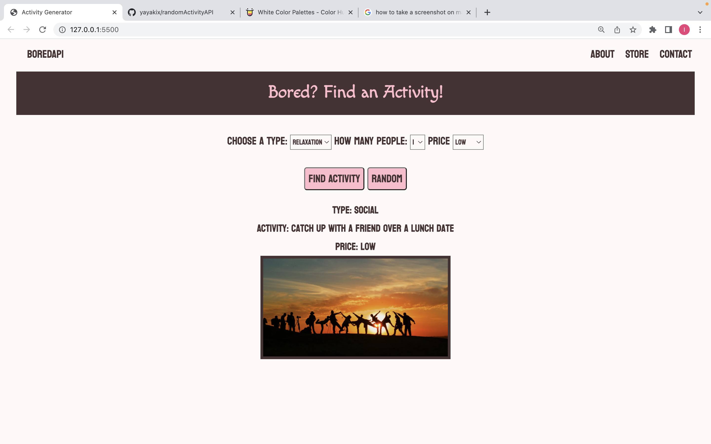

# Activity Generator

## Technologies Used
- HTML
- CSS
- Javascript
- JQuery
- BoredAPI
- Pexels.com

<!-- img goes here -->

## Getting Started
<!-- link to website -->
This app generates random activitys using the BoredAPI. You can ask for a random activity or have it suggest one based on specific search parameters. 

## Future Enhancements
- Images of the specific activity suggested
- More specific search parameters
- More activities suggested by the api at a time
- Better styling for user experience

